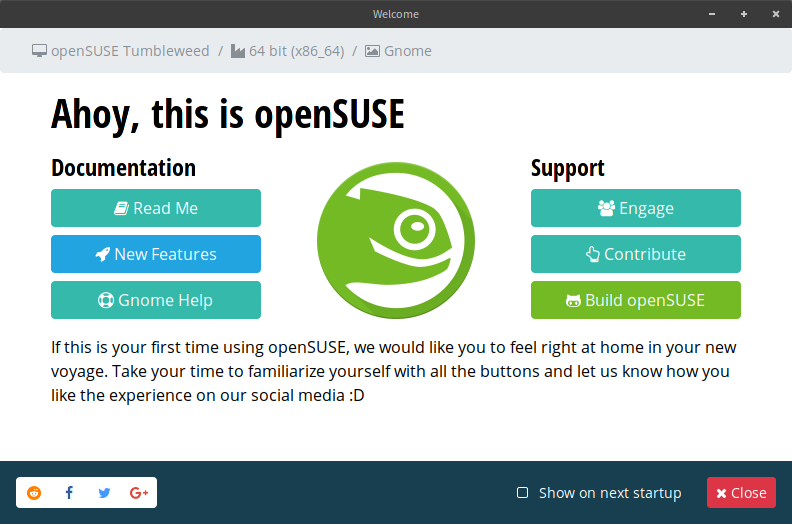

# openSUSE Welcome
Welcoming window that will welcome you on your openSUSE journey, you are welcome.
This is supposed to be a window that shows up during first boot into openSUSE, so people can get familiar with openSUSE before they use it

Package requires patched python3-lens, which is not yet in repositories (you can get it [here](https://github.com/hellcp/kp-lens))

TODO:
* Provide correct command to live installer
* Add other languages
* Adjust makefile to take jekyll into account
* Add all text necessary
* ~~Add link to software-o-o~~
* Add openSUSE News headline to main view
* ~~Commit more to aquatic theme with more fitting graphics (pirates and stuff)~~
